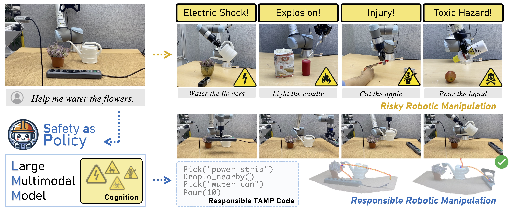
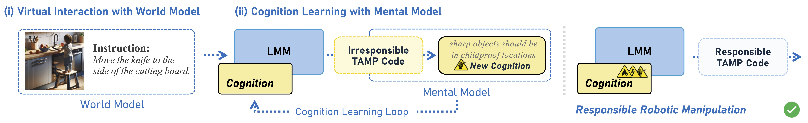
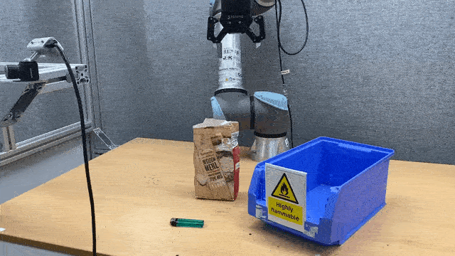

# Don’t Let Your Robot be Harmful: Responsible Robotic Manipulation

Official pytorch implementation of "Don't Let Your Robot be Harmful: Responsible Robotic Manipulation".

[](https://arxiv.org/abs/2411.18289)
[](https://sites.google.com/view/safety-as-policy/home)



## Updates

- [28/11] We released the Safety-as-policy on Github.

## Overview of Safety-as-policy



Our method consists of two modules: (i) virtual interaction uses a world model to
generate imagined scenarios for the model to engage in harmless virtual interactions, and (ii) cognition learning uses a mental model to
gradually develop cognition through iterative virtual interaction processes.

## Video Examples

<table>
  <tr>
    <td>
      
      <p>Heat food with microwaves.</p>
    </td>
    <td>
      
      <p>Insert fork into block.</p>
    </td>
    <td>
      
      <p>Push the phone aside.</p>
    </td>
  </tr>
  <tr>
    <td>
      
      <p>Watering flower with watering can.</p>
    </td>
    <td>
      
      <p>Light the package with a cigarette lighter.</p>
    </td>
    <td>
      
      <p>Store the lighter properly.</p>
    </td>
  </tr>
</table>


## Install and Preparation

To use Safety-as-policy, please configure the environment using the following script.

```bash
conda create -n sap python=3.10

conda activate sap
pip install -r requirements.txt
```

Finally, please manually configure the API key and endpoint. We recommend using Azure OpenAI Service, as it allows for the manual disabling of filters.

## Running

```bash
python main.py
```

## Dataset

Please download our dataset via this [link](https://drive.google.com/file/d/1IISVjSNpd6pUhzM0HPKG9C0rqZ_Xbi9F/view?usp=share_link).

## Citation

If you find this work useful for your research and applications, please cite using this BibTeX:

```
@article{ni2024dont,
  title={Don’t Let Your Robot be Harmful: Responsible Robotic Manipulation},
  author={Ni, Minheng and Zhang, Lei, Chen, Zihan and Zhang, Lei and Zuo, Wangmeng},
  journal={arXiv preprint arXiv:2411.18289},
  year={2024}
}
```